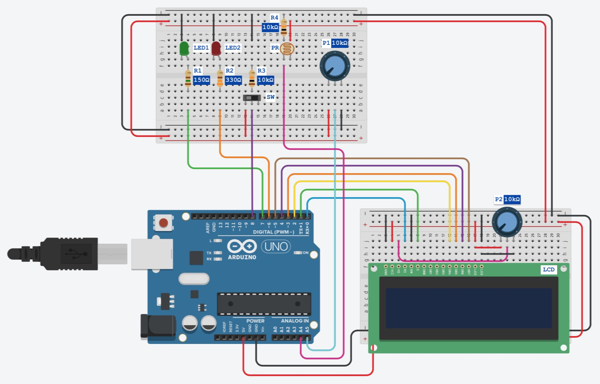

# Automated water pump control system

### Description

This project is meant to be used in a system with a set of photovoltaic solar panels and a battery.
The system does the control of a water pump based on readings from the following sensors:
  - Battery level (voltage).
  - Sunlight level.
  - Water tank max level detector.

The code is specifically designed for Atmega328P chip that you can find in Arduino board.
The entire code is written in C/C++ and does not uses Arduino libraries. Additionally, the implementation takes advantage of a number of interrupt functionality as well as PWM and Timers.
You can also see the readings from the mentioned sensors on a LCD 2x16 screen (implemented with use 4-bit mode).
The circuit for the system should be wired according the following:

### Parts Needed

- Arduino UNO - `Atmega328P`
- Resistor - `R1 = 150Ω`
- Resistor - `R2 = 330Ω`
- Resistor - `R3 = 10kΩ`
- Resistor - `R4 = 10kΩ`
- LCD - `Parallel - 4bit`
- Photoresistor `PR`
- Pump Working Indicator `LED1` (can be replaced with a relay to power water pump)
- Alarm Indicator `LED2` (can be replaced with any other indicator)
- Water Limit Switch `SW` (can be replaced with a proper water limit switch)
- Potentiometer `P1 = 10kΩ` (can be replaced with a battery output (with small modification))
- Potentiometer `P2 = 10kΩ` (not really required, it is used to adjust the brightness of the LCD)

### Developed in
Atmel Studio 7
