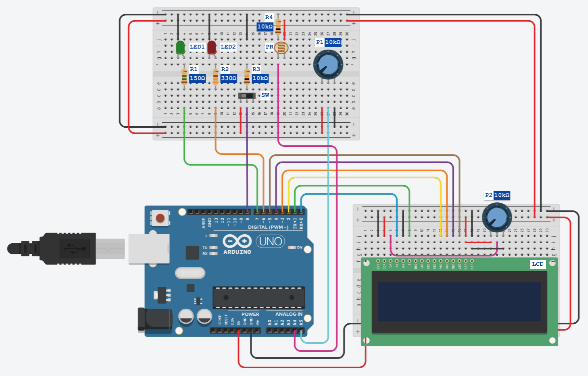

# Automated water pump control system

(prototype) for Arduino UNO

This project is ment to be used in a system with a set of photovotaic solar panels and a battery.
The system does the control of a water pump based on readings from the following sensors:
  - Battery level (voltage).
  - Sunlight level.
  - Water tank max level detector.

The code is specificaly designed for Atmega328P chip that you can find in Arduino board.
The entire code is written in C and does not uses Arduino libraries. Additionally, the implementation takes advantage of a number of interrupt functionality as well as PWM and Timers.
You can also see the readings from the mentioned sensors on a LCD 2x16 screen (implemented with use 4-bit mode).
The citrcuit for the system should be wired according the following:

### Developed
in Atmel Studio 7
